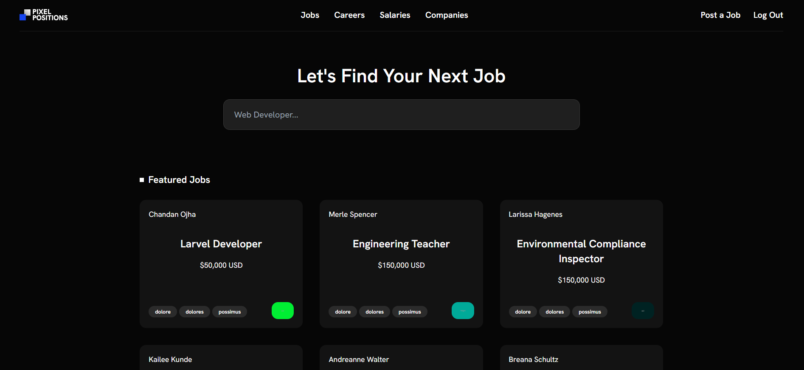

<h3 align="center">Job Portal</h3>

#### Why?
Job Portal is a simple job listing application that allows users to post jobs and search for jobs.

#### Features
- User authentication
- Job listing (Featured Jobs & Recent Jobs)
- Job Posting
- Job search by title & tag

#### Tech used

- [Laravel](https://laravel.com)
- [PHP](https://www.php.net)
- [SQLite](https://www.sqlite.org/)
- [Tailwind CSS](https://tailwindcss.com)

#### How to run
Follow the instructions

- Clone the repository
- Run `composer install`
- Run `npm install && npm run dev`
- Copy the `.env.example` file to `.env` and configure your database
- Run `php artisan key:generate` to generate the application key
- Run `php artisan storage:link` to create a symbolic link to the storage directory
- Create database file `database/database.sqlite` and update the `.env` file with the database path
- Run `php artisan migrate --seed` to create the database tables and seed the database
- Run `php artisan serve` to start the server and access the application
- 
#### Caution
This project is intended for experiment.

#### Contribution
Ideas and contributions are welcome! 🙌

